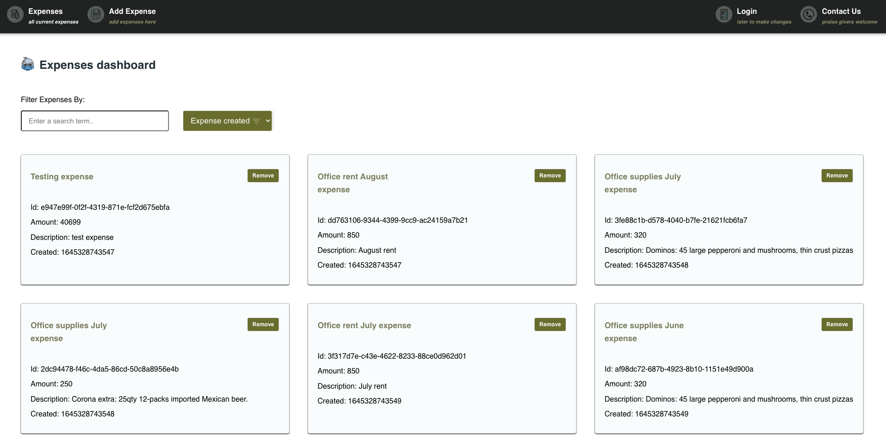
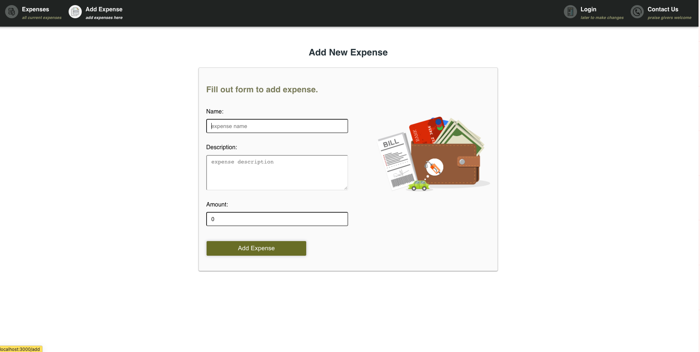

 &nbsp;  &nbsp; 

 

<h2 align="center">Updtng-reactster</h2>

 🩹 📆. 😇.  📋

- A starting templating-type application with routes, 
- Redux CRUD to create, delete expenses
- Redux Store w/2 reducers for expenses & filtering expenses
- GSAP easing pages animation (top-bottom, and left-to-right)
  
  

  

[screenshots]

 

